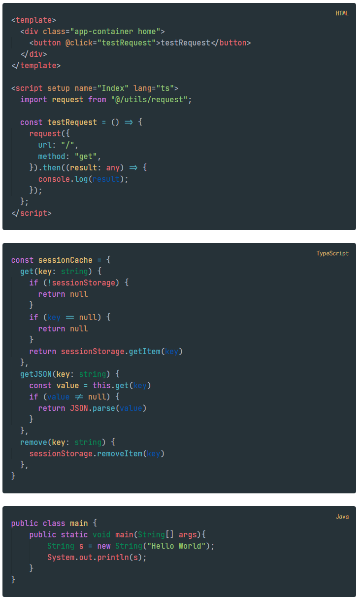
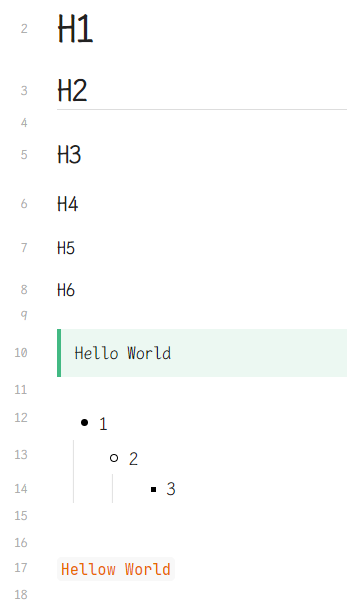

# obsidian-code-block-snippet

## How to install

1. Download the files (Code -> Download ZIP)
2. Open your Obsidian.md vault in explorer
3. Copy and paste the .obsidian folder in it
4. Go to: Obsidian app -> Settings -> Appearance -> CSS Snippets

- `CodeBlock.css`

- `VuepressFix.css`

